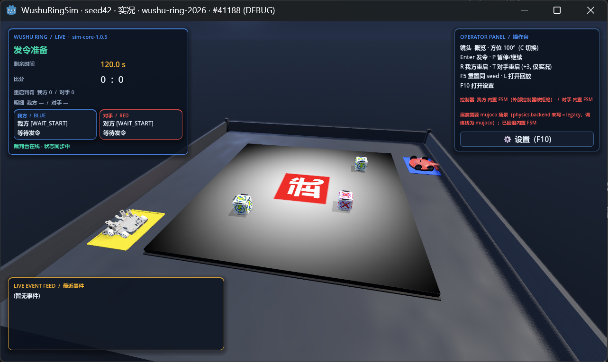

# robot-simulator — RoboCup 武术擂台轮式对抗模拟器

可维护、可复现、可替换控制器的桌面仿真：**.NET 8 确定性内核** + **Godot 4 .NET 3D 桌面壳** +
**Python 策略桥**，共享同一套比赛状态协议与规则。



## 快速开始

需要 [.NET 8 SDK](https://dotnet.microsoft.com/download/dotnet/8.0)。

```bash
dotnet build                                   # 构建
dotnet test                                    # 运行回归测试

# 无头比赛(内置 FSM)
dotnet run --project src/Sim.Cli -- match --seed 42

# AI agent 无头批量仿真(多种子并行, JSONL 机器可读, 不启动 Godot)
dotnet run --project src/Sim.Cli -- batch --seeds 1,2,3,4 --parallelism 4 --duration 3
# → stdout 每个输入种子一行 sim-batch-result-v1 JSON(输入顺序), 退出码 0/1/2
#   详见 docs/CLI.md 的 batch 章节

# 接入外部 Python 策略(我方)
dotnet run --project src/Sim.Cli -- match --seed 42 \
  --controller-us "python controllers/example_controller.py"

# 录制并校验回放(确定性证据)
dotnet run --project src/Sim.Cli -- replay-record --seed 42 --out replays/seed-42.json
dotnet run --project src/Sim.Cli -- replay-check replays/seed-42.json

# 离线标定真机遥测(telemetry-v1 → 参数报告/新场景; 采集规范见 telemetry/README.md)
dotnet run --project src/Sim.Cli -- calibrate --input telemetry/data/<export>.json --out calibration/report.json

# MBri 传感器标定证据导入(sensor-calibration-v1; 与物理标定分线, 不影响运行时)
dotnet run --project src/Sim.Cli -- sensor-calibration import --data-dir <MBri/data> --manifest selection.json --out calibration/sensor-report.json
```

物理/裁判参数可经场景 `parameters` 覆盖（键与默认值见 `src/Sim.Core/SimParameters.cs`），
如反僵局铲刃微调：正面顶牛的同型机器人由种子派生初相的慢速正弦铲刃微调周期性触发楔入
（`antiStallBladeAmp` 默认 0.006 m，**0=关闭逐位恢复旧行为**，周期 2.1/2.7 s；有意偏差，
见 `docs/PORTING_NOTES.md`）。

## 强化学习试点（SCORE_BLOCK，离线）

`controllers/score_block_rl/` 提供官方 MuJoCo 场景的 Gymnasium 环境、Stable-Baselines3 PPO 训练和配对评测。11 维观测包含仿真真值块坐标，训练出的模型不能直接用于真机，也不会替换默认 FSM。完整复现命令见[训练与评测说明](controllers/score_block_rl/README.md)。

当前试点采用单环境、小型 MLP；MuJoCo 仿真在 .NET 进程中运行，每步通过 JSONL 与 Python 通信。Stable-Baselines3 自动选择策略网络设备，已有训练记录为 CPU。GPU 只可能加速网络计算，无法加速这部分仿真和通信；项目尚未做 CPU/GPU 同条件性能对比。设备检查方法见上述训练文档。

split v3 的单次盲验**未通过**：PPO 取得 2 次锁定目标真实 `BlockScore`，同入口 FSM 取得 6 次；我方掉台为 25 次，对照 FSM 的 29 次。详情见[验收报告](.trellis/tasks/archive/2026-09/09-26-score-block-v3-edge-speed-retrain/report.md)。此后 v4 轮五训练 seed 开发集 **3/5**，低于 4/5 直接冻结门槛，归档为**负面基线**：未冻结候选、`final_holdout_v4` 未打开（0 消耗，[v4 多训练 seed 报告](.trellis/tasks/archive/2026-09/09-27-rl-v4-split-multiseed/report.md)）；奖励归因门控变体三 seed 筛查 1/3 停止（[报告](.trellis/tasks/archive/2026-09/09-27-rl-v4-reward-credit/report.md)）；v5 台沿风险轮在训练前 No-Go（零训练消耗，[报告](.trellis/tasks/archive/2026-09/09-28-rl-v5-edge-risk/report.md)）。两次奖励侧修法均被数据否定，盲集 `final_holdout_v4` 仍未打开。

## 桌面端(Godot 4 .NET)

需要安装 [Godot 4.x .NET (Mono)](https://godotengine.org/download)（当前按 4.7.2 验证，
SDK 为 `Godot.NET.Sdk/4.7.2`）。启动窗口版：

```bash
godot --path godot                          # 实况: Enter 发令, P 暂停, R/T 真实重启 (对手 +4)
godot --path godot -- --replay-path ../replays/godot-parity-seed42.json   # 打开回放
godot --path godot -- --scenario-path scenarios/wushu-ring-2026.json      # 加载指定布局场景
```

桌面端支持 **布局编辑模式**(E 进入): 选择场地/出发区/能量块, 拖动+旋转+网格吸附,
Ctrl+Z/Y 撤销重做, 保存/重载 `arena-layout-v1` JSON 场景并应用到仿真; 机器人可导入
`.glb/.gltf` 外观模型(仅渲染层)。按 F10 或右上角按钮打开玻璃控制台设置页，可调整分辨率、
全屏/UI 缩放、全部已登记仿真参数，并为双方绑定外部 Python/C# 等 JSONL 控制器；显示设置即时生效，
仿真参数和控制器在下一场或 F5 重置后生效。详见 `godot/README.md`。

无头跨端一致性校验（与 Sim.Cli `replay-check` 语义一致，比对最终比分/结束原因/末帧/事件指纹）：

```bash
godot --headless --path godot -- --parity-check ../replays/godot-parity-seed42.json
```

操作、架构与保真度边界见 `godot/README.md` 与 `docs/ARCHITECTURE.md`。

## 目录

| 路径 | 内容 |
| --- | --- |
| `src/Sim.Core` | 确定性比赛内核（规则/物理/传感器/事件/快照），无引擎依赖 |
| `src/Sim.Protocol` | 版本化协议 DTO 与 JSON 校验（含 telemetry-v1 遥测契约） |
| `src/Sim.Controller` | CLI/Godot 共用的外部控制器 JSONL stdio 桥（每角色/每场独立进程） |
| `src/Sim.Cli` | 无头评测/回放 + Python 进程适配器 + `calibrate` 离线标定 |
| `src/Sim.Calibration` | 纯标定库（物理拟合器/mount 门控评估/传感器回放评估器/报告指纹），无 IO 副作用于内核 |
| `src/Sim.Tests` | xUnit 回归 |
| `godot/` | Godot 4 .NET 桌面壳（已编译验证，见 `godot/README.md`） |
| `controllers/` | 示例外部策略（JSONL stdio） |
| `scenarios/` | 固定布局回归场景 |
| `telemetry/` | 真机遥测实验规范与模板（数据在 `telemetry/data/`，不入库） |
| `replays/` | 回放文件（不入库） |
| `tools/legacy-baseline.js` | 从旧原型再生成回归基线 |
| `fidelity.json` | 保真度声明 |

## 文档

- [AI / 外部程序接入指南（把用户程序接进模拟器）](docs/AGENT_GUIDE.md)
- [架构与确定性契约](docs/ARCHITECTURE.md)
- [控制器协议 decide(obs)→{v,w}](docs/CONTROLLER_PROTOCOL.md)
- [Sim.Cli 命令参考](docs/CLI.md)
- [移植决策记录](docs/PORTING_NOTES.md)
- [从旧原型迁移](docs/MIGRATION.md)

## 已知局限

以下是项目的真实能力边界（2026-10-03），按对用户的影响排序：

**强化学习（试点）**

- RL 策略整体仍**不敌内置 FSM**：历史多轮训练的盲验/门槛未通过（详见上文 RL 试点小节与归档报告）。物理域校准后所有旧 checkpoint 失效；最新探索轮（随机块域随机化 + aggression 奖励变体）产出了项目首个过 gate 的 checkpoint（推块数追平 FSM、掉台更少），但训练后期会衰减回"保台读秒"的保守策略，奖励侧修法已确认收益递减，根治需要行为克隆热启动等结构手段（未立项）。
- RL 的 11 维观测包含仿真真值块坐标（特权状态），训练出的策略**不能直接部署到真机**；外部 RL 控制器只在 MuJoCo 场景可用（legacy 场景明确拒绝并回退内置 FSM）。
- RL 与物理参数强耦合：物理标定/模型一变，旧 checkpoint 全部失效，需要重训（2026-10 已发生一次）。

**上台与运动保真度**

- 登台/爬沿模拟保真度不足：v2 真车场景的原地转向只有 ~1.2 rad/s（真车实测 ~2.4 rad/s），根因是 MuJoCo 各向同性接触摩擦无法表达真车胎纹的各向异性，属建模缺口；登台依赖 20° 工程缓坡，不是真实爬沿机构。
- legacy（默认）是 2D 简化物理：无翻覆/侧倾自由度；MBri 控制器的"倒车登台"是脚本化平移上台，不是真实爬沿动力学。
- MuJoCo 最坏对撞仍有 ~27 mm 残余压入（接触参数扫描确认调不掉，需接触模型层工作）；出生瞬间有 ~0.45 m 的接触解算蠕爬残余。

**控制器**

- 内置 MBri 控制器（可选档）回台率有限：MuJoCo 下中位 50%（legacy 对照 67%），台角/围栏卡位残例存在。

**车辆建模与传感器适配（每车不同，机制已参数化）**

- 车辆建模分两档：v1 为工程几何（盒体+铲斗+圆柱轮）；v2 真车为 `装配.glb` 实测 mesh（轮距/轮心/质心配重均实测锚点）。
- 传感器按**车辆 profile 参数化**：每车通过 `sensors: {id}` 选择传感器档（内置 `legacy14` 兼容档 / `wheeledCombat11` 真车 11 路档，或自定义通道 JSON），每个通道带安装位置（纵向/横向/离地高度/朝向/视场角/量程）——观测里的 `sensorLayout` + `rawSensors` 即按车给出，采样按安装位置投影。
- 置信度如实分级：`wheeledCombat11` 的对角/铲下/铲前通道为装配.glb 光电节点实测坐标（`tools/mesh/sensor_mounts.json`），**底盘灰度 4 路为工程兜底（低置信）**；`legacy14` 是兼容档、非任何真车；MBri 的灰度/红外走标定换算层（结构忠实、数值近似）。
- 读数本身仍是解析投影近似（非物理光学仿真）：遮挡/散射/噪声不建模。

**保真度等级**

- **真机保真度未晋升**：`fidelity.json` 只到"场地布局已验证；摩擦/碰撞/堵转/登台未标定"，真机遥测采集尚未执行——模拟成绩不能当真机成绩引用。
- **视觉是半特权管线**：桌面 vision live 吃 CSV 帧回放/投影桥（观测里的 `objects` 坐标是仿真真值包装，非真实相机检测）；真实相机 + YOLO 推理的端到端尚未在桌面完整目检。

**确定性契约**

- legacy 物理默认行为已于 2026-10-03 有意变更（接触修复 L1+L2+L3 默认全开），**旧 legacy 回放文件在新默认下不可复现**；`replays/seed-42.json` 基线已重录（5:10 / 302 事件），同默认下逐位确定性不变。

其余口径见下方 [保真度边界](#保真度边界) 与 [`fidelity.json`](fidelity.json)。

## 保真度边界

规则与场地布局(图纸尺寸/位姿一致性)已验证；场地灰度为手绘、视觉为随机桩、摩擦/碰撞/堵转/登台未标定。
见 [`fidelity.json`](fidelity.json)。**模拟结果不能直接宣称为真机成绩。**
